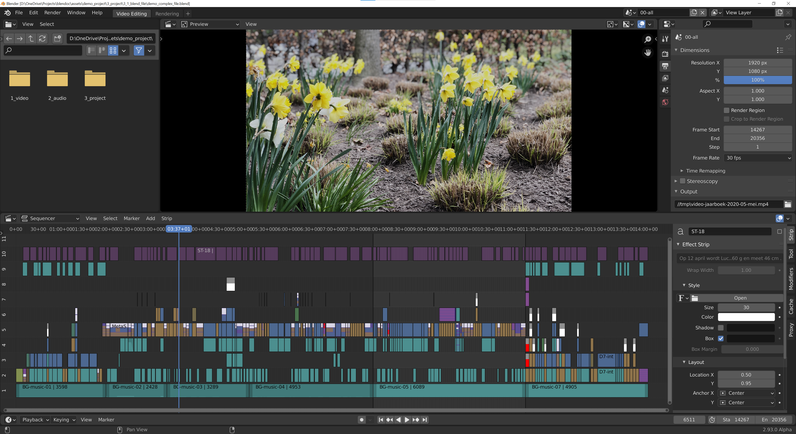

# 1.1 Organizing your assets

Even a moderate-sized video project can contain hundreds of assets. It's very easy to get lost in that huge amount of source files. On top of that, you can create additional files during the edit such as subclips, subtitles, animations, masks, proxies, and so on.

The example in figure 1 takes 14 minutes and contains about 500 strips. As you can see from the coloring, various strip types \(movies, text, sound, meta, ...\) are used. A well-thought-out organization is crucial. Certainly, if you are working in a team or for an extended period of time. Without any form of naming conventions, a file named "mask-17" or "IMG-2128" won't ring a bell after even a week. You have to open each strip to see what it means.

